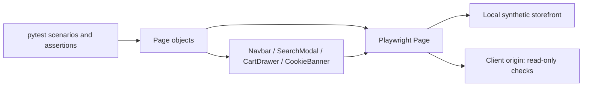

# PG Original — QA Automation Portfolio

[](https://github.com/MiltonKlun/PG_Original_POM/actions/workflows/ci.yml)
[](https://github.com/MiltonKlun/PG_Original_POM/actions/workflows/live-smoke.yml)
[](https://github.com/MiltonKlun/PG_Original_POM/actions/workflows/compatibility.yml)

Python 3.12, synchronous Playwright and pytest automation for the
[PG Original client storefront](https://www.pgoriginal.com/). This portfolio
demonstrates POM composition, isolated scenarios, meaningful cart assertions,
reproducible data and failure investigation.

**Two targets, different evidence:** the default local simulation tests the
automation against synthetic products and an observed UI contract. Separate
read-only live checks validate selected client pages. Mock success does not
certify production shopping, authentication or delivery.

Hosted acceptance is verified in [PR #1](https://github.com/MiltonKlun/PG_Original_POM/pull/1):
[mock CI](https://github.com/MiltonKlun/PG_Original_POM/actions/runs/34922388895),
[deliberate failure evidence](https://github.com/MiltonKlun/PG_Original_POM/actions/runs/34922413481),
[live smoke](https://github.com/MiltonKlun/PG_Original_POM/actions/runs/34922559492), and
[compatibility](https://github.com/MiltonKlun/PG_Original_POM/actions/runs/34922559490).
PR #1 is merged and `main` is protected by the three required mock CI checks.
The badges above follow the default branch; weekly live and compatibility
schedules are enabled. Post-merge runs are recorded in the release evidence.
See [IMPROVEMENTS.md](IMPROVEMENTS.md), the [case study](docs/case-study.md), and
[release evidence](docs/evidence/release-verification.json).

## Architecture



Page objects expose domain actions and scoped locators. A small `BasePage`
composes shared UI modules; those modules do not inherit from it. Tests own
business assertions and use Playwright's retrying `expect` assertions. Browser
and context lifetime belongs to pytest-playwright. There are no generic
click/fill wrappers, fixed sleeps, custom retries or injected validation.

| Location | Responsibility |
|---|---|
| `pages/`, `components/` | Page/shared UI interactions and selector rationale |
| `config/`, root `conftest.py` | Target validation, seeded data, money parsing, reporting |
| `tests/`, `tests/framework/` | UI behavior and offline checks |
| `data/test_data.json` | Named expected data, independent of the mock catalog |
| `mock_site/`, `scripts/serve_mock.py` | Synthetic storefront, Python/Docker serving and readiness |
| `.github/workflows/` | Mock gates; separate live and compatibility checks |

## Coverage and boundaries

**62 cases: 37 offline checks and 25 UI cases.** The
[scenario map](docs/test-strategy.md) traces the original eight scenarios to the
expanded suite.

| Area | Assertions and scope |
|---|---|
| Navigation/search | Home/shop access; search focus/close; matching and empty results; local menu-to-product access |
| Product discovery | Selected identity, positive current ARS price, enabled add control; local filter/reset and unavailable stock |
| Cart — local only | Exact product/variant/quantity, line/subtotal amounts, quantity update, removal and isolated initial state |
| Authentication | Local invalid credentials/native input cases; non-submitting reset-page navigation |
| Contact | Seeded and explicit accented/whitespace inputs; native email validity; no submission |
| Framework | Target isolation, data validation, server lifecycle and ARS parsing |

Weekly live smoke selects three read-only cases. Eleven UI cases are eligible
for broader live checks; eligibility does not mean they all ran live. Cart
mutation, login rejection and unavailable stock are simulated. There are no
real purchases, payments, account creation, reset emails or contact delivery.
The contact challenge stays untouched; a timeout alone is not diagnosed as
anti-bot blocking. See the [observed contract](docs/site-contract.md).

## Quickstart — Windows PowerShell

Install Python 3.12. Docker is optional. From a clean clone:

```powershell
git clone https://github.com/MiltonKlun/PG_Original_POM.git
cd PG_Original_POM
py -3.12 -m venv .venv
.\.venv\Scripts\python.exe -m pip install --require-hashes -r requirements.txt
.\.venv\Scripts\python.exe -m pip check
.\.venv\Scripts\python.exe -m playwright install chromium
.\.venv\Scripts\python.exe -m pytest
```

The quickstarts are available on `main`. Direct venv paths avoid a PowerShell activation
policy change. The headless default starts/stops its own Python server on
`http://127.0.0.1:8090`. No global packages or `.env` are required.

Explicit read-only live smoke:

```powershell
$env:TARGET = 'live'
try {
    .\.venv\Scripts\python.exe -m pytest tests -m "smoke and live_safe" --browser chromium
} finally {
    Remove-Item Env:TARGET
}
```

## Quickstart — Linux/POSIX shell

Use Python 3.12 on a Playwright-supported Linux distribution. Installing browser
system dependencies requires the platform package manager. Local Linux
verification used a clean Debian container; hosted Ubuntu 24.04 CI also passed.

```bash
git clone https://github.com/MiltonKlun/PG_Original_POM.git
cd PG_Original_POM
python3.12 -m venv .venv
. .venv/bin/activate
python -m pip install --require-hashes -r requirements.txt
python -m pip check
python -m playwright install --with-deps chromium
python -m pytest
TARGET=live python -m pytest tests -m "smoke and live_safe" --browser chromium
```

POSIX syntax also works on macOS, but macOS execution has not been verified.
See [Playwright platform requirements](https://playwright.dev/python/docs/intro).

## Optional Docker mock

Build/run this foreground server in one terminal:

```text
docker build -t pgoriginal-mock mock_site
docker run --rm -p 127.0.0.1:8090:80 pgoriginal-mock
```

In a second terminal, use the venv Python path on Windows or an activated venv
on Linux:

```text
python -m pytest --base-url http://127.0.0.1:8090
```

Pytest verifies `/__health` and reuses the server without stopping it. Stop the
foreground Docker command with Ctrl+C when finished. Do not also start the
default Python-owned server on that port.

## Replay, reports and compatibility

These examples use an activated venv; Windows may substitute
`.\.venv\Scripts\python.exe` for `python`.

```text
python -m pytest tests/test_cart.py --seed 1729
python -m pytest tests/framework
python -m black --check conftest.py config pages components tests scripts
python -m flake8 conftest.py config pages components tests scripts
python -m playwright install firefox webkit
python -m pytest tests -m "not framework" --browser firefox
python -m pytest tests -m "not framework" --browser webkit
python -m pytest tests -m smoke --browser chromium --device "Pixel 7"
```

On Linux, add `--with-deps` when installing additional browsers. Faker inputs
derive from seed **1729** and the case ID; emails use `example.com`. Each scenario
gets a fresh context. Mock enforcement rejects external HTTP(S) requests.
Settings validate targets/origins; collection excludes mutation cases from live
runs. Mobile coverage is **emulation**, not real-device testing.

Executions create `reports/<run-id>/report.html`, `results.xml`, `summary.json`
and `logs/<run-id>.log`. Failure traces, screenshots and video are retained in
`test-results/<run-id>/`. HTML opens offline; JSON records target, seed,
browser/device, revision and outcomes. Custom `--run-id` values are one-use to
protect evidence. Collection-only creates no report.

```text
python -m playwright show-trace test-results/<run-id>/<failed-case>/trace.zip
```

Use the [debugging guide](docs/troubleshooting.md) before sharing evidence. Raw
live traces can contain session/client data. See [CI maintenance](docs/ci-maintenance.md)
for jobs, dependency updates and remaining publication checks. Staging,
accessibility and visual regression remain explicitly scoped extensions.

## Project context and license

The original project records client permission for portfolio demonstration.
That statement is retained as historical project context; it does not expand
rights over client branding/assets or authorize live transactions. The local
storefront uses synthetic content. Repository source uses the [MIT License](LICENSE).

**Milton Klun — QA Automation Engineer** ·
[LinkedIn](https://www.linkedin.com/in/milton-klun/) ·
[Portfolio](https://www.miltonklun.com)
