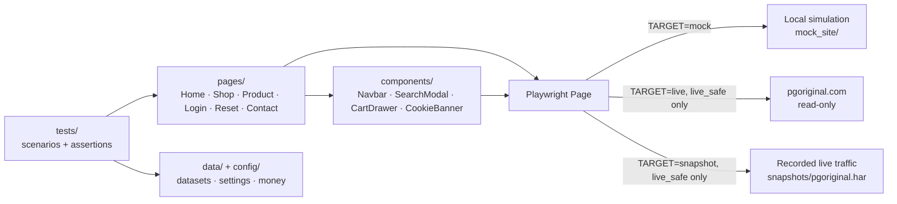

# PG Original - Page Object Model

<br>

<div align="center">
  
  <br>
  <br>
  <h2>Test automation framework built based on my work at <a href="https://www.pgoriginal.com/">pgoriginal.com</a></h2>
  <p><b>Python · Playwright · Pytest · Page Object Model</b></p>
</div>


<div align="center">
  <a href="https://www.pgoriginal.com/">
    
  </a>
  <a href="https://www.instagram.com/pgoriginalind/">
    
  </a>
</div>

---

<div align="center">
  <a href="https://github.com/MiltonKlun/PG_Original_POM/actions/workflows/ci.yml"></a>
  <a href="https://github.com/MiltonKlun/PG_Original_POM/actions/workflows/live-smoke.yml"></a>
  
  
</div>

<br>

> [!NOTE]
> **About this repository.** This is a portfolio version of the test
> automation I built while testing the [PG Original](https://www.pgoriginal.com/)
> e-commerce storefront. It is **not** PG Original's production test suite and
> it doesn't run against their live store by default. Tests run against a
> **local simulation of the storefront** that reproduces the real site's
> markup with synthetic products, carts and forms. An optional read-only
> smoke check against a few public pages confirms that the page objects still
> match the real site. It never adds to cart, logs in or submits forms.

## At a glance

Measured on 2026-09-29.

| Measure | Value |
|---|---|
| Test cases | 241: 79 browser scenarios and 162 offline framework checks |
| Mutation score | 100%: all 27 injected storefront defects detected (first measured at 6 of 13) |
| Live read-only coverage | 43 `live_safe` checks, run weekly; 42 of them also replayed offline from a recording of the store on every pull request |
| Accessibility | No axe-core WCAG 2.1 A/AA violations on five live pages in their default state; keyboard and open-panel checks found 5 issues |
| Store defects found | 8, reported privately to the client; 6 are tracked by 11 strict expected-failure checks |
| Suite duration | Simulation: 44 s serial, 22 s parallel (Windows, 12 threads); snapshot replay: about 60 s with 4 workers |
| Flakiness | None: 5 consecutive parallel runs of all 79 browser scenarios with no outcome changes (nightly check) |

## Contents

- [At a glance](#at-a-glance)
- [What this project demonstrates](#what-this-project-demonstrates)
- [How the simulation relates to the real store](#how-the-simulation-relates-to-the-real-store)
- [Architecture](#architecture)
- [Test coverage](#test-coverage)
- [Getting started](#getting-started)
- [Running tests](#running-tests)
- [Reports and debugging](#reports-and-debugging)
- [Continuous integration](#continuous-integration)
- [Documentation](#documentation)

## What this project demonstrates

| Area | How it shows up in the code |
|---|---|
| **Page Object Model** | Page objects in `pages/` own locators and user actions, and navigation returns the page you land on. Shared UI (navbar, search, cart drawer, cookie banner) are components in `components/`, each rooted in its own locator and composed, not inherited. |
| **Type safety** | The framework is fully annotated and checked with mypy in CI; test data is loaded into typed, validated dataclasses. |
| **Business assertions** | Tests check outcomes, not visibility: the clicked product is the product shown; cart lines match exact product, variant, quantity, line amount and subtotal. |
| **Resilient locators** | Role/label locators where the site provides them; CSS scoped to the owning form or panel where it doesn't, with the reason documented next to it. No arbitrary `.first`, no fixed sleeps. |
| **Environment safety** | Target and URL are validated before a browser starts. `live_safe` / `mock_only` markers are enforced at collection, so no cart or form action can reach production. Mock runs fail on any external request. Live runs block ad pixels, analytics and the store's visit counter, and identify themselves in the user agent. |
| **Data-driven testing** | Named datasets in JSON drive parametrized auth, contact, search and filter cases; seeded Faker (`es_AR`) makes generated data reproducible per test. |
| **Correct money handling** | ARS prices (`$29.000,00`) parsed into integer minor units with a strict parser that rejects instalment and ambiguous text. |
| **Accessibility** | axe-core WCAG 2.1 A/AA scans (engine bundled locally) plus keyboard checks of every header panel; known store defects run as strict expected failures on live, so a fix is reported automatically. |
| **Snapshot and visual testing** | The store's read-only traffic is recorded, sanitized and replayed offline as a third target (`TARGET=snapshot`), so live-safe checks run deterministically on real markup; a weekly job re-records it and opens an issue when page-object selectors stop matching. Screenshots of the simulation are compared with reviewed baselines rendered in a pinned Playwright container, so results don't depend on the machine's fonts. |
| **Evidence and reporting** | Per-run HTML, JUnit and JSON reports tagged with target, browser, seed and git revision; trace, screenshot and video kept on failure. |
| **CI/CD** | Required checks on Ubuntu and Windows, Docker-served mock UI tests, weekly cross-browser and live read-only runs, nightly flaky-test detection, a published HTML report, SHA-pinned actions and pinned dependencies. Ruff, mypy and framework tests also run as pre-commit hooks. |

## How the simulation relates to the real store

| | Local simulation (default) | Live read-only smoke (optional) | Snapshot replay |
|---|---|---|---|
| **Runs against** | `mock_site/` on `http://127.0.0.1:8090` | `https://www.pgoriginal.com` | A sanitized recording of the live store in `snapshots/` |
| **Data** | Synthetic products (`QA Remera`, `QA Gorra`, `QA Agotado`) and fixed prices | Whatever the store shows that day | The store as it was when recorded |
| **Covers** | Everything, including cart add/quantity/remove, sold-out products, invalid login and form validation | Home, menu, search, product details, catalog and price consistency, filters, pagination, page health and the locator contract (weekly) | The same read-only checks, except the link check, which needs the network |
| **Purpose** | Deterministic, repeatable proof that the tests detect wrong outcomes | Early warning that the real markup has changed | Deterministic runs on real markup, on every pull request |
| **Never does** | Contact external hosts | Add to cart, log in, submit forms, send email, bypass challenges | Contact any host; everything is served from the recording |

The simulation's markup is based on what I observed on the real site
(see the [site contract](docs/site-contract.md)). Its behavior is specified
in [`mock_site/CONTRACT.md`](mock_site/CONTRACT.md). Mock results show that the
automation works. They are not a claim about PG Original's production systems.

## Architecture


```mermaid
flowchart LR
    T["tests/<br/>scenarios + assertions"] --> P["pages/<br/>Home · Shop · Product · Login · Reset · Contact"]
    P --> C["components/<br/>Navbar · SearchModal · CartDrawer · CookieBanner"]
    P --> PW["Playwright Page"]
    C --> PW
    T --> D["data/ + config/<br/>datasets · settings · money"]
    PW -->|TARGET=mock| M["Local simulation<br/>mock_site/"]
    PW -->|TARGET=live, live_safe only| L["pgoriginal.com<br/>read-only"]
    PW -->|TARGET=snapshot, live_safe only| S["Recorded live traffic<br/>snapshots/pgoriginal.har"]
```

```text
├── pages/                  # Page objects: navigation and user actions
│   ├── base_page.py        #   Shared navigation; composes UI components
│   ├── home_page.py
│   ├── shop_page.py        #   Product discovery and filtering
│   ├── product_page.py     #   Product details, variants, add to cart
│   ├── login_page.py       #   Login form and forgot-password link
│   ├── password_reset_page.py # Password-reset destination
│   └── contact_page.py     #   Contact fields (never submitted)
├── components/             # Navbar, search modal, cart drawer, cookie banner
├── config/                 # Target settings, typed test data, UI copy, ARS money, reporting
├── tests/                  # UI scenarios + tests/framework/ offline checks
├── data/                   # Named datasets and expected values
├── mock_site/              # Local storefront simulation + behavior contract + Dockerfile
├── snapshots/              # Sanitized recording of the live store, replayed offline
├── scripts/                # Mock server, snapshot, mutation, flaky-test and CI summary tools
└── .github/workflows/      # Mock CI, live smoke, browser compatibility
```

**Design rules**

- Tests talk only to page objects; no selectors in tests.
- Components are rooted in a locator; navigation methods return the page
  object you land on, so journeys read (and type-check) as a chain.
- Page objects take a Playwright `Page`, navigate with relative paths and never
  read environment variables or know which target they're running against.
- Tests own expected values and assertions. Page objects only wait for the
  result of their own action (e.g. a variant shows as selected).
- Web-first `expect` for UI state; plain `assert` for computed values.

## Test coverage

**241 cases:** 79 browser scenarios and 162 offline framework checks
(settings validation, parallel-run rules, data loading, page navigation
contract, live traffic policy, accessibility results, money parsing and
formatting, server lifecycle, snapshot sanitizing and drift, screenshot
comparison, mutation and flaky-test harnesses). A mutation check injects 27 realistic storefront
defects into the simulation; the suite currently detects all 27.

| Area | Scenarios | Target |
|---|---|---|
| Home & navigation | Title, header/footer, shop link; menu → SHOP panel → product | Mock + live |
| Search | Open, focus and close; matching results; empty-result state; exact result sets (3 datasets) | Mock + live / mock |
| Shop | Color and size filters apply/clear; load-more pagination; per-variant price and compare-at price, carried into the cart; sold-out product can't be added | Mock |
| Product details | Clicked product == page heading; current price is a valid ARS amount | Mock + live |
| Cart | Add with size/color, add with quantity, repeat add merges lines, quantity update, removal of one or all lines, persistence across pages, empty start, product without variants | Mock |
| Authentication | Invalid credentials (2 datasets); native validation (3 cases); reset-password navigation | Mock / mock / mock + live |
| Contact | Seeded, accented and whitespace inputs; malformed emails; disabled submit | Mock + live / mock |
| Locator contract | Every page-object locator resolves on the target without changing state (7 pages/components) | Mock + live |
| Catalog integrity | Card prices match their variant data; listing, product page and data attribute agree; variant prices follow selection; size filter; infinite-scroll pagination; structured data (a known store defect on live) | Mock + live |
| Page health | No JavaScript errors or failed first-party responses on four pages; home-page links resolve (robots.txt respected) | Mock + live |
| Accessibility | WCAG 2.1 A/AA scans of five pages and three open panels; keyboard focus, Escape and named close controls for search, menu and cart | Mock + live (known defects expected to fail) |
| Visual regression | Five pages and the cart drawer with one item, compared with reviewed baselines (desktop Chromium, reference container) | Mock |

The full risk-based scenario map, eligibility rules and known gaps are in the
[test strategy](docs/test-strategy.md).

## Getting started

**Prerequisites:** Python 3.12. Docker is optional.

```bash
git clone https://github.com/MiltonKlun/PG_Original_POM.git
cd PG_Original_POM
python -m venv venv
```

Activate the environment:

```powershell
# Windows PowerShell
.\venv\Scripts\Activate.ps1
```

```bash
# Linux / macOS
source venv/bin/activate
```

Install the pinned dependencies and Chromium:

```bash
python -m pip install -r requirements.txt
python -m pip check
python -m playwright install chromium
```

On Linux, use `python -m playwright install --with-deps chromium` to include
system libraries. Verified on Windows and Ubuntu; macOS has not been verified.

To contribute, install the development tools (Ruff, mypy, pre-commit) and the
git hooks, which run the same checks as CI before each commit:

```bash
python -m pip install -r requirements-dev.txt
python -m pre_commit install
```

## Running tests

```bash
python -m pytest                 # Full suite against the local simulation (headless)
python -m pytest -m smoke        # Navigation, search, product smoke
python -m pytest -m shop         # Shopping and cart flows
python -m pytest -m auth         # Login and password-reset
python -m pytest -m contact      # Contact form (never submitted)
python -m pytest tests/framework # Offline framework checks only
python -m pytest --headed        # Watch the browser
python -m pytest --seed 1729     # Reproduce generated data
python -m pytest -n auto         # Parallel run (simulation only; live runs are serial)
python -m scripts.visual         # Visual checks in the reference container (needs Docker)
```

The default run starts and stops its own local server on
`http://127.0.0.1:8090` and blocks any external request.

**Optional: live read-only smoke**

```powershell
# Windows PowerShell
$env:TARGET = "live"
try { python -m pytest tests -m "smoke and live_safe" --browser chromium }
finally { Remove-Item Env:TARGET }
```

```bash
# Linux / macOS
TARGET=live python -m pytest tests -m "smoke and live_safe" --browser chromium
```

This selects four read-only checks (home/shop access, menu navigation,
search, product details). On the live target, every test not marked `live_safe` is deselected
automatically.

**Offline replay of the live store**

```bash
# Linux / macOS (PowerShell: set $env:TARGET as above)
TARGET=snapshot python -m pytest tests -n 4
python -m scripts.snapshot record    # Re-record from the live store (read-only, serial)
```

**Optional: Docker-served simulation**

```bash
docker build -t pgoriginal-mock mock_site
docker run --rm -p 127.0.0.1:8090:80 pgoriginal-mock
# in another terminal:
python -m pytest --base-url http://127.0.0.1:8090
```

Pytest checks the server's identity endpoint and reuses it without stopping it.

**Cross-browser and mobile emulation**

```bash
python -m playwright install firefox webkit
python -m pytest tests -m "not framework" --browser firefox
python -m pytest tests -m "not framework" --browser webkit
python -m pytest tests -m smoke --browser chromium --device "Pixel 7"
```

Pixel 7 is device emulation, not a real device.

## Reports and debugging

Each run writes to `reports/<run-id>/`:

- `report.html`: self-contained HTML report (open directly in a browser)
- `results.xml`: JUnit
- `summary.json`: counts, target, browser, seed, git revision

The report from the latest `main` run is published at
**[miltonklun.github.io/PG_Original_POM](https://miltonklun.github.io/PG_Original_POM/)**.

Failed tests keep a trace, screenshot and video in `test-results/<run-id>/`,
and runtime logs go to `logs/`:

```bash
python -m playwright show-trace test-results/<run-id>/<failed-case>/trace.zip
```

Use `--run-id <name>` for a named run (IDs are single-use, so evidence is
never overwritten). The [troubleshooting guide](docs/troubleshooting.md)
explains how to tell setup errors, assertion failures, locator ambiguity and
environment problems apart.

## Continuous integration

| Workflow | Trigger | What it runs | Blocks merge |
|---|---|---|---|
| [Mock CI](.github/workflows/ci.yml) | PR / push to `main` | Ruff (format and lint), mypy and framework checks on Ubuntu + Windows; all UI tests on Chromium against the Docker-served simulation | Yes |
| [Mock CI](.github/workflows/ci.yml), visual job | PR / push to `main` | Screenshot comparison with the reviewed baselines, in the reference Playwright container | No |
| [Mock CI](.github/workflows/ci.yml), snapshot job | PR / push to `main` | The 42 replayable read-only checks against the recorded live store, offline | No |
| [Browser compatibility](.github/workflows/compatibility.yml) | Weekly / manual | Full UI suite on Firefox and WebKit; Pixel 7 smoke | No |
| [Live read-only smoke](.github/workflows/live-smoke.yml) | Weekly / manual | All 43 read-only checks on pgoriginal.com, with trackers blocked | No |
| [Snapshot refresh](.github/workflows/snapshot-refresh.yml) | Weekly / manual | Re-records the live store (read-only), compares the selectors the page objects use and replays the suite on the new recording; opens an issue on drift | No |
| [Mutation score](.github/workflows/mutation.yml) | Weekly / manual / PRs touching tests or the simulation | Injects each catalogued defect and fails if fewer than 90% are detected | No |
| [Security](.github/workflows/security.yml) | PR / push to `main` / weekly / manual | Known-vulnerability audit of the pinned dependencies (pip-audit) and workflow security analysis (zizmor) | No |
| [Flaky test check](.github/workflows/flaky.yml) | Nightly / manual | Five parallel runs of the simulation suite; fails if any test's outcome changes between runs | No |
| [Test report](.github/workflows/pages.yml) | Push to `main` / manual | Runs the simulation suite and publishes its HTML report to [GitHub Pages](https://miltonklun.github.io/PG_Original_POM/) | No |

Every job uploads its reports (and, for mock failures, traces, screenshots,
videos and server logs) as artifacts for 14 days. The job summary refuses to
render without real JUnit output, so a crashed run can't look green.

## Documentation

- [Test strategy](docs/test-strategy.md): scope, environments, risk-based scenario map, known gaps
- [Observed site contract](docs/site-contract.md): what the page objects rely on on the real store
- [Case study](docs/case-study.md): design decisions, a real failure investigation, and how the suite was checked for sensitivity
- [Troubleshooting](docs/troubleshooting.md): rerunning, traces and failure classification
- [Simulation contract](mock_site/CONTRACT.md): routes and simulated behavior of the local storefront

## Scope and disclaimer

> [!IMPORTANT]
> This project is based on QA work I performed for **PG Original**, and it is
> shared with the client's permission for portfolio purposes. It is not
> affiliated with or maintained by PG Original. The local simulation uses
> synthetic data only. Live checks are read-only: they never submit
> credentials, contact messages, orders or reset requests, and they don't
> bypass challenges. Passing mock tests don't certify production checkout,
> payments or authentication.

---

## License

This project is licensed under the [MIT License](LICENSE).

---

## Author

**Milton Klun**  
*QA Automation Engineer | AI Quality Testing*

<div align="left">
  <a href="https://www.linkedin.com/in/milton-klun/"></a><a href="mailto:miltonericklun@gmail.com"></a><a href="https://www.miltonklun.com"></a>
</div>
